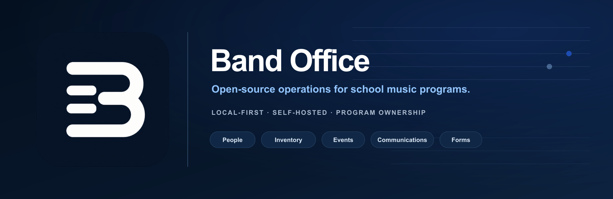
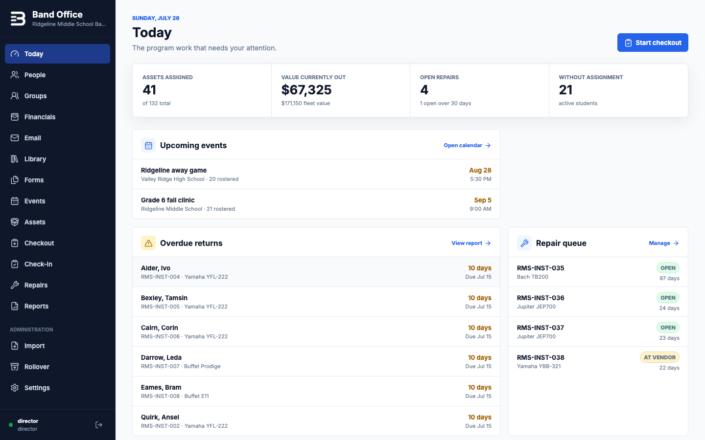
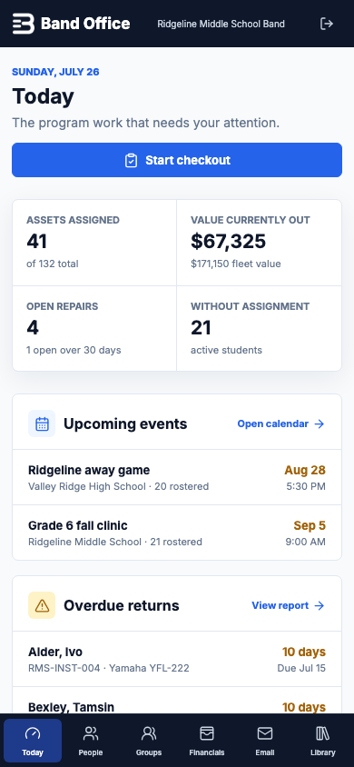

<p align="center">
  <a href="./LICENSE"></a>
  <a href="./CURRENT_STATUS.md"></a>
  <a href="./package.json"></a>
  <a href="https://github.com/band-office/band-office/actions/workflows/release-candidate.yml"></a>
</p>

<p align="center">
  <strong><a href="#clean-local-setup">Set up locally</a></strong> ·
  <strong><a href="#built-around-real-program-work">See what works</a></strong> ·
  <strong><a href="./SERVER_DEPLOYMENT.md">Deployment guide</a></strong> ·
  <strong><a href="./CONTRIBUTING.md">Contribute</a></strong> ·
  <strong><a href="./ROADMAP.md">Roadmap</a></strong>
</p>

Band Office keeps the operational work of a school music program in one local-first, self-hostable system: people and groups, instruments and uniforms, checkout and repairs, student fees, communications, music library records, forms, events, attendance, reports, rollover, and a relationship-scoped family portal.

It is built for program ownership rather than platform lock-in. Records live in SQLite, complete backups are exportable, permissions are explicit, and the documented server path keeps district-approved infrastructure in control.

> [!IMPORTANT]
> Band Office is a **public source release candidate**. No public Desktop alpha or supported Server release has been issued. Signing, clean-machine acceptance, public-server acceptance, district approval, and the real-data pilot remain release gates. Read [CURRENT_STATUS.md](./CURRENT_STATUS.md) before using it with a school program.

Band Office source is licensed under [Apache-2.0](./LICENSE). Third-party components retain their own terms as summarized in [NOTICE](./NOTICE).

## Release channels

| Channel | Current state | Intended user |
| --- | --- | --- |
| Source release candidate | Available on `main` | Contributors and technical reviewers using fictional data |
| Band Office Desktop alpha | Not yet issued | Directors running one local program without public family access |
| Band Office Server technical preview | Source and operator kit available; no supported image published | District IT evaluation with fictional data |

These channels are intentionally separate. Desktop does not expose student or guardian portals to the internet. Server and family portals remain a district-operated technical preview until the external acceptance gates pass. See [RELEASE_CHANNELS.md](./RELEASE_CHANNELS.md).

## Built around real program work

| Program work | What Band Office covers |
| --- | --- |
| People and groups | Students, guardians, staff, boosters, contact relationships, classifications, sections, and reusable groups |
| Property and custody | Instruments, uniforms, equipment, labels, scanning, checkout, check-in, condition history, repairs, and rollover |
| Money records | Student charges, manual payments, credits, group assessments, balances, statements, reversals, and exports |
| Communication | Shared-mailbox SMTP, audiences, templates, attachments, schedules, holds, delivery history, and reporting |
| Library, forms, and events | Whole-set music records, versioned form campaigns, calendars, RSVP, attendance, itineraries, equipment, and volunteers |
| Stewardship | Role-based access, append-only audit history, encrypted backups, CSV reports, and district-operated deployment |

Band Office does not yet replace every Charms or CutTime workflow. Granular guardian permissions, household accounting, payment processing, family form submission, and provider OAuth adapters remain later work. Drill design and Pyware replacement are explicitly outside this project’s current scope.

<details>
<summary><strong>Complete release-candidate feature inventory</strong></summary>


- First-run program setup and local staff accounts protected with Argon2id
- 30-minute inactivity sessions and protected application/export routes
- A unified People directory for students, guardians, staff, boosters, and external contacts
- Multi-classification people, student profiles, guardian/student links, and reusable flat groups
- Searchable guardian/student linking with inline guardian creation; student IDs remain optional administrative identifiers
- Director, assistant director, inventory helper, and read-only staff roles with server-enforced permissions
- Student fee accounts with individual charges, manual payments, credits, current balances, printable statements, and immutable reversals
- Group assessments that snapshot active student membership at posting time
- Financial balance, transaction-ledger, assessment-history, and individual-statement CSV exports
- Shared-mailbox SMTP configuration and verification, with no password stored in SQLite, exports, or audit history
- Email targeting by contact type, group, grade, guardians of students, or selected people
- Guardian deduplication across linked students, immutable audience previews, address-level contact holds, attachments, templates, schedules, retries, and visible delivery failures
- Director-enabled student and guardian portal accounts with self-service password setup and recovery by one-time emailed code
- Non-enumerating reset responses, 15-minute single-use codes, attempt and request limits, Argon2id password storage, and session revocation after reset
- Persistent, identifier-hashed throttling for repeated staff and portal password failures, including unknown-account attempts
- Desktop background delivery while Band Office is open, with staff confirmation required after a missed scheduled time
- Announcement-history, recipient-delivery, and contact-readiness CSV reports
- Whole-set score-and-parts catalog with audited loans, missing-component history, performance history, and overdue tracking
- Managed local library files and approved HTTPS links with copyright acknowledgment, hashes, retention status, and controlled download
- Versioned form templates with short and long text, single and multiple choice, checkboxes, ordinary acknowledgments, and managed file uploads
- Form campaigns for students, guardians, or both, resolved from active people, grades, and groups into permanent recipient snapshots
- Staff response entry, drafts, completion and waiver tracking, reviewable email reminder drafts, retention purge, and six form CSV reports
- Event series, public and private events, preserved group-based roster snapshots, itinerary, RSVP, attendance, equipment packing, and trip rosters
- Bounded volunteer opportunities and assignments, managed event files and approved HTTPS links, and reviewable email reminder drafts
- Public iCalendar subscription and embeddable calendar page, plus revocable private calendar links whose bearer tokens are stored only as SHA-256 hashes
- Event roster, RSVP, attendance, absence, volunteer, trip-roster, and equipment-list CSV reports
- Mapped student and asset CSV imports with a dry-run preview and automatic section-group membership
- Permanent person, group-membership, and assignment history
- Instrument, uniform-piece, and equipment inventory with attached components
- Barcode and QR lookup by camera or connected scanner, using asset tags or serial numbers
- Single-asset and batch QR/Code 128 label printing on Letter-sized label sheets
- Keyboard-first checkout and check-in to any active person, with optional validated group context, condition snapshots, and expected returns
- Printable, director-editable paper checkout agreements
- Atomic damage return and repair creation
- Repair queue, vendor/cost tracking, closeout, and lifetime service history
- Thirty-one program-level CSV reports, individual statement exports, browser print layouts, and operational queues
- Encrypted full backups containing 51 CSV tables, a manifest, managed library, form, and event files, and a consistent SQLite snapshot
- Append-only audit history for record changes, imports, exports, and backups
- Archive-gated operating-period rollover with configurable graduation grade

</details>

## Product preview

<p>
  
  
</p>

The repository screenshots use deterministic fictional data. More views are available in [`docs/screenshots`](./docs/screenshots).

## Desktop release candidate

Unsigned macOS and Windows packages are produced and tested in GitHub Actions, but they are temporary engineering artifacts rather than public downloads. The first Desktop alpha will be published as a GitHub prerelease only after both platform jobs produce signed artifacts and the macOS package passes notarization.

The desktop app requires no terminal, Node.js, or Docker. It creates and migrates its private SQLite database under `~/Library/Application Support/BandOS/data/bandos.db`; logs and pre-migration or pre-restore recovery snapshots stay in that application-data directory. The legacy directory name is intentionally retained so the Band Office rename cannot strand an existing installation. SMTP credentials use operating-system encrypted storage under the same application-data root and never enter the database. Encrypted backup and verified restore remain available in Settings. Camera access is requested only when the director starts barcode or QR scanning; connected USB and Bluetooth scanners work through the same asset-tag field without camera permission.

Do not redistribute unsigned CI artifacts or present them as the director download. See [DESKTOP_ALPHA_RELEASE.md](./DESKTOP_ALPHA_RELEASE.md) for the fail-closed signing and publication gate.

## Clean local setup

Requires Node.js 20.9 or newer.

```bash
npm install
npm run db:deploy
npm run dev
```

Open [http://localhost:3000](http://localhost:3000). The first-run screen creates the program, opening school-year period, and director account. Use a password with at least 12 characters.

To replace an empty local database with the deterministic Ridgeline demo instead, run `npm run db:init`. That command is destructive and must never be used against real program data.

## Local Docker

```bash
docker compose up --build
```

The root Compose file is a local technical convenience. It runs one container, exposes port 3000, and mounts the SQLite database at `/data/bandos.db`. It is not the public family-portal deployment. Demo data is off by default. To load Ridgeline into a new empty volume:

```bash
BANDOS_LOAD_DEMO=true docker compose up --build
```

## Server and family portal technical preview

The documented server path is an operator technical preview for evaluation with fictional data. It is not a supported school deployment. The intended future deployment is a district-approved Linux server using the separate Band Office Server bundle. Caddy is the only public service and provides HTTPS; the application and scheduled-email worker remain behind it. SQLite and every managed upload persist under the protected `data` directory. SMTP and worker credentials are mounted as Docker secrets.

Start with [SERVER_DEPLOYMENT.md](./SERVER_DEPLOYMENT.md). The complete operator set is:

- [SERVER_ACCEPTANCE_RECORD.md](./SERVER_ACCEPTANCE_RECORD.md)
- [PORTAL_ACTIVATION.md](./PORTAL_ACTIVATION.md)
- [SERVER_BACKUP_RESTORE.md](./SERVER_BACKUP_RESTORE.md)
- [SERVER_UPGRADE.md](./SERVER_UPGRADE.md)
- [SERVER_SUPPORT_BOUNDARY.md](./SERVER_SUPPORT_BOUNDARY.md)

Build and statically verify the distributable operator bundle:

```bash
npm run server:verify
npm run server:bundle -- --image ghcr.io/OWNER/band-office:VERSION
```

No canonical Band Office Server image has been published. Do not activate real family accounts or use shared hosting, cPanel file upload, home-server port forwarding, the development server, or the root local Compose file for student and guardian access.

## Backups

Settings offers an encrypted `.bandos` archive by default and an explicitly marked readable ZIP export for district-approved encrypted storage. The passphrase is never stored and cannot be recovered.

Verify that an archive decrypts, contains every required file, passes SQLite integrity checking, and matches CSV row counts:

```bash
npm run backup:verify -- /path/to/backup.bandos "your backup passphrase"
```

Rollover remains blocked until every assignment is resolved and a backup newer than the latest record mutation exists.

## Email setup

Open Email, then Shared mailbox. Standard SMTP is the currently implemented connector. Desktop users store the SMTP password through operating-system encrypted storage and restart Band Office before verification. Production-server administrators mount it from `secrets/smtp-password.txt`; the container entrypoint reads it without placing the value in Compose or SQLite. Sender settings, templates, announcements, attachments, audience snapshots, attempts, queue state, and contact holds are included in version-8 backups; credentials are not.

Scheduled desktop email runs only while Band Office is open. Server deployments run the authenticated internal worker continuously. If a scheduled time passes while the relevant runtime is down, the message is held until a staff user confirms delivery. Provider acceptance records SMTP handoff, not guaranteed inbox delivery. See [EMAIL_SETUP.md](./EMAIL_SETUP.md).

## Student and guardian portal

Directors enable portal access on an eligible student or guardian record after adding a unique email address. The user chooses **Forgot or need to set your password?** on the portal sign-in screen, receives an eight-digit code through the verified shared mailbox, and sets a password without staff intervention. Guardians see only explicitly linked students. The first portal release is read-only and shows current property, fee balances, and assigned form status.

The Electron desktop app listens only on the local machine, so it cannot serve parents over the public internet. Family access requires a district-approved server deployment reachable through HTTPS. Do not expose the development server or raw Band Office port directly to the internet.

## Verification

```bash
npm ci
npm run release:verify
```

The release gate runs lint, 48 seeded unit tests, a production build, desktop migration and restore failure-path acceptance, the complete Playwright workflow, static privacy/network/package audits, a clean dependency-tree check, and the production-dependency npm advisory audit. Development and packaging dependencies remain exact-pinned and separately reviewed. See [SECURITY_CHECKLIST.md](./SECURITY_CHECKLIST.md) and [UPDATE_POLICY.md](./UPDATE_POLICY.md) for the evidence record and manual update rules.

Build an unsigned desktop application for the current platform:

```bash
npm run desktop:pack
npm run desktop:dist:mac   # macOS DMG and ZIP
npm run desktop:dist:win   # Windows NSIS installer and ZIP; run on Windows
```

Desktop packaging compiles the standalone application, rebuilds native modules for Electron, packages the app, and restores the contributor installation to the normal Node ABI. See [DESKTOP_PACKAGING.md](./DESKTOP_PACKAGING.md) for data paths, release commands, and signing gates.

The unit suite recreates only `data/test.db`. The browser suite recreates only `data/e2e.db`, starts an isolated loopback server on port 3102, and verifies first-run auth, CSV import, SMTP configuration, financial workflows, whole-set library workflows, a complete versioned form campaign, an event with RSVP, attendance, equipment, volunteers, managed files, reminders and calendar feeds, inventory checkout, repair creation, encrypted backup verification, logout, and API protection. Neither suite resets `data/bandos.db`.

## Privacy boundary

The People directory stores names, optional email and phone, classifications, student grade/ID, group membership, and explicit guardian/student links. Financial records store student-linked charges, payments, credits, references, group context, and reversals; they do not store card or bank credentials. Communication records store authored messages, attachment bytes, audience snapshots, recipient addresses, and delivery outcomes. Form records store assigned recipients, answers, ordinary acknowledgment timestamps, and approved uploads under explicit retention rules. Event records store roster snapshots, RSVP, attendance status, itineraries, equipment, volunteers, reminders, and approved files; there is no attendance-reason field. Only director and assistant-director roles can access communications, forms, and events. The schema intentionally has no address, birthdate, medical, photo, or disciplinary fields. Inventory helpers can use names, grade, student ID, groups, holdings, inventory, repairs, and fixed reports, but cannot view contact details, guardian relationships, financials, communications, forms, events, notes, or exports. Portal users are scoped to their own person record and explicitly linked students; director notes, contact directories, attendance, and staff surfaces are not exposed.

> No medical, disciplinary, or family information. This field is exported in reports.

Run Band Office on a district-managed, disk-encrypted machine. Store backups and readable exports only in district-approved locations, and clear real student-data use with school administration.

## Release status

The source is publicly available at [band-office/band-office](https://github.com/band-office/band-office) under Apache-2.0. The macOS and Windows package candidates pass automated build and application acceptance, and a local Linux ARM64 server image passed isolated container acceptance. Those results do not create a public product release. A reviewed alpha tag, Apple signing and notarization, Windows signing, clean-machine acceptance, public registry publication, public-server acceptance, district approval, and the SDMS real-data pilot remain open.

## Project and community

- [Contributing](./CONTRIBUTING.md)
- [Roadmap](./ROADMAP.md)
- [Governance](./GOVERNANCE.md)
- [Support](./SUPPORT.md)
- [Security policy](./SECURITY.md)
- [Code of Conduct](./CODE_OF_CONDUCT.md)
- [Changelog](./CHANGELOG.md)
- [Release channels](./RELEASE_CHANNELS.md)
- [Desktop alpha release process](./DESKTOP_ALPHA_RELEASE.md)
- [Brand guide](./docs/brand/README.md)

Band Office is maintained in public and welcomes bounded, evidence-backed contributions. The best first contribution is often a reproduced bug, a clearer setup step, an accessibility finding, or a small workflow improvement grounded in the daily work of a school music program.
