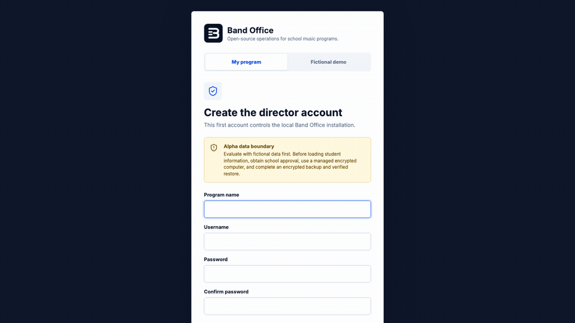

# First Run: Band Office Desktop

This guide takes a director from download to a safe first look at the application. It applies to the Desktop app only. It does not set up student or guardian portal access.

## 1. Install the app

Download the installer for your computer from [Download Band Office Desktop](./DOWNLOAD.md).

- **Mac:** Open the downloaded `.dmg`, drag Band Office to Applications, then open it from Applications.
- **Windows:** Open the downloaded `.exe`. SmartScreen may ask you to choose **More info**, verify that the app is Band Office, then choose **Run anyway**.

The Desktop app runs locally. You do not need Terminal, Node.js, Docker, a web server, or a GitHub account.

## 2. Choose how to begin

The first screen offers two choices.

- **Fictional demo:** Loads the invented Ridgeline Middle School Band so you can explore without student information. This is the recommended first step for every evaluator.
- **My program:** Creates an empty local program for an approved real deployment.

Create the local director username and password on the same screen. Keep this password available; the Desktop app has no email-based director-account recovery.

## 3. Explore the demo, then reset it

The demo banner stays visible while Ridgeline is loaded. Do not add real student records to that installation.

When you are ready to begin your own approved program, choose **Start my program** in the demo banner. Band Office saves a recovery copy of the demo, clears the active demo data, restarts, and returns to this first-run screen. Choose **My program** to create an empty installation.

## 4. Complete the local safety check

Before loading real student information, make sure that your school has approved the local deployment and that the computer and backup storage are district-managed and encrypted. In Settings, create an encrypted backup and verify that it restores before relying on the app for program records.

## 5. Start with the core workflow

1. Import students from **People**.
2. Add or import instruments, uniforms, and equipment in **Assets**.
3. Review the checkout agreement text in **Settings** and edit it for your program before printing agreements.
4. Run one practice checkout and check-in.

For student and guardian portals, scheduled email that runs while the app is closed, or public web access, use the separately released district-operated [Band Office Server](../deployment/SERVER_DEPLOYMENT.md). Do not expose Desktop to the internet.
